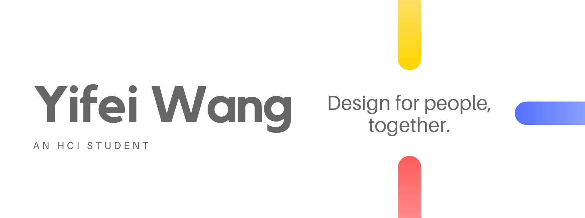

# 

    

I am a master's student who has a strong passion for Human-Computer Interaction, especially in Usability Engineering and User Experience Design.  

# My Skills
## Design

## Tools

## Languages

